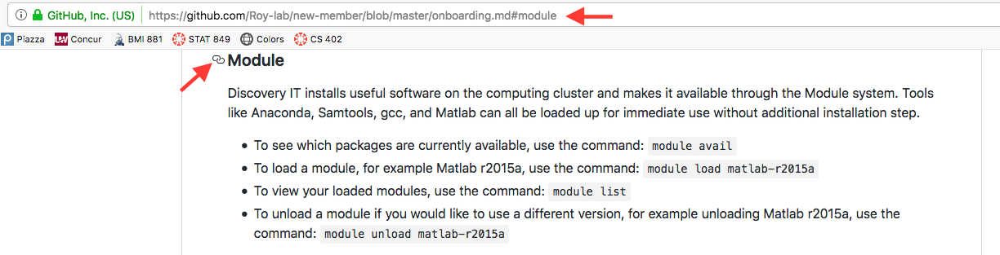

## References and resources for new members

### View

Go to: https://github.com/Roy-lab/new-member/blob/master/onboarding.md

### Share

1. This is **private repo**. Make sure you added the recipient to our Github group.
2. Send them the link above. To share a specific section, hover over the section heading to expose the link; click on the link will jump you to the section-specific URL.


### Update

Instead of directly editing the onboarding.md file, which will make the original R markdown file go out of sync with it, please update the R markdown file (the .Rmd file), re-knit the github document (the .md file), and push the content back. R markdown has the benefit of letting you generate the content in different file formats (see below).

1. Clone the repo.
2. Open up onboarding.Rmd in RStudio; make sure you have rmarkdown installed.
3. Update the 'Last Updated' date.
4. Make changes and re-knit the document.
5. Push your changes back.

### Generate PDF or HTML

If you want to generate the onboarding document in **PDF**:

1. Clone the repo.
2. Make a copy of onboarding.Rmd.
3. Open up the copy in RStudio; make sure you have rmarkdown installed.
4. Update the header section to use a different output format:
```
---
title: "Welcome to Roy Lab"
date: "Last updated MM/DD/YYYY"
output: 
  pdf_document:
    toc: true
---
```
5. Knit the document.

Similarly, to generate an **HTML**:

1. Clone the repo.
2. Make a copy of onboarding.Rmd.
3. Open up the copy in RStudio; make sure you have rmarkdown installed.
4. Update the header section to use a different output format:
```
---
title: "Welcome to Roy Lab"
date: "Last updated MM/DD/YYYY"
output: 
  html_document:
    theme: flatly
    toc: true
    toc_float: true
---
```
5. Knit the document.
